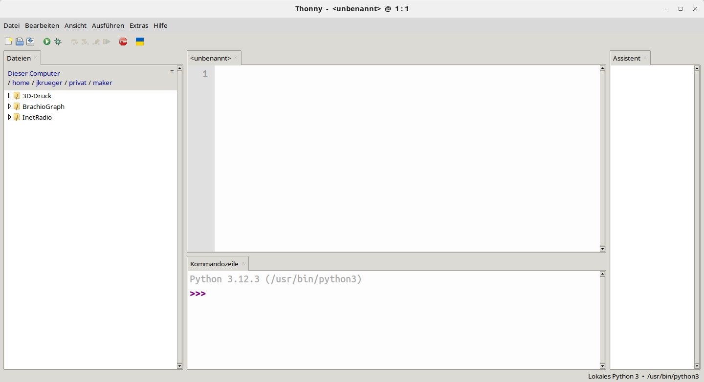

# Erste Schritte

Python ist eine dynamische Programmiersprache die in der Vergangenheit oftmals nur als Skriptsprache „abgestempelt“ wurde.

- Python 1.0 →  1991
- Python 3.13: aktuell stabile Version
  - inkompatibel zu älteren Python Versionen
- Jedes Jahr kommt ein neues Minor Release  heraus
- mindestens 5 Jahre lang Support in Form von Sicherheitsaktualisierungen

### Aufgabe
Welche Python Version ist auf eurem Rechner installiert ?

## Eigenschaften

- Optimiert auf Lesbarkeit
- Wenige Schlüsselwörter
- Multi OS und Plattform Support 
  - Windows, OSX, Linux, *nix artige Systeme
  - MicroController (MicroPython)
- Integriertes Hilfesystem
- Starke Typisierung
- Blöcke werden durch Einrückung gekennzeichnet.

## Python – Features und Erweiterungen

- Python Shell  ->  Interaktiver Pythonmodus 
- iPython -> mächtige Alternative interaktive Shell
- Editoren -> **thonny**, gedit
- Entwicklungsumgungen -> Visual Studio Code, PyCharm/IntelliJ

## thonny

Thonny ist ein relativ einfacher Editor  der Python (und Micropython) unterstützt und gerade für den Anfang gut geeignet ist. Thonny unterstützt das direkte Ausführen von MicroPython auf einem MicroController.

1. Editorfenster
1. Interaktive PythonShell
1. Dateibrowser

## Hallo Welt - interaktiv

1. Starte Python im interaktive Modus (z.B. in einem Terminal)
   - Am Python Prompt kannst direkt Python Befehle eingeben, die sofort ausgeführt werden.

1. Gib `print("Hallo Welt!")` ein. Was passiert ?

- Print ist eine Funktion, welches Argumente auf der Konsole ausgibt
- Funktionen bestehen immer aus dem Funktionsnamen (`print`), gefolgt von einer öffnenden und schließenden runden Klammer. In der Klammer stehen die Argumente der Funktion (optional, das hängt von der Funktion ab).

##  Hallo Welt

1. Auf der Kommandozeile:
   - Erstelle eine leere Datei mit dem Namen `hallowelt.py` in dem Verzeichnis `maker/Erste Schritte`.
   - öffne die Datei mit "thonny" vom Terminal.
   - Gibt `print("Hallo Welt!")` in das Editorfenster ein und speichere die Datei.
   - Führe das Programm direkt aus "thonny" heraus aus.
   - Ruf das Python Programm vom Terminal auf.

