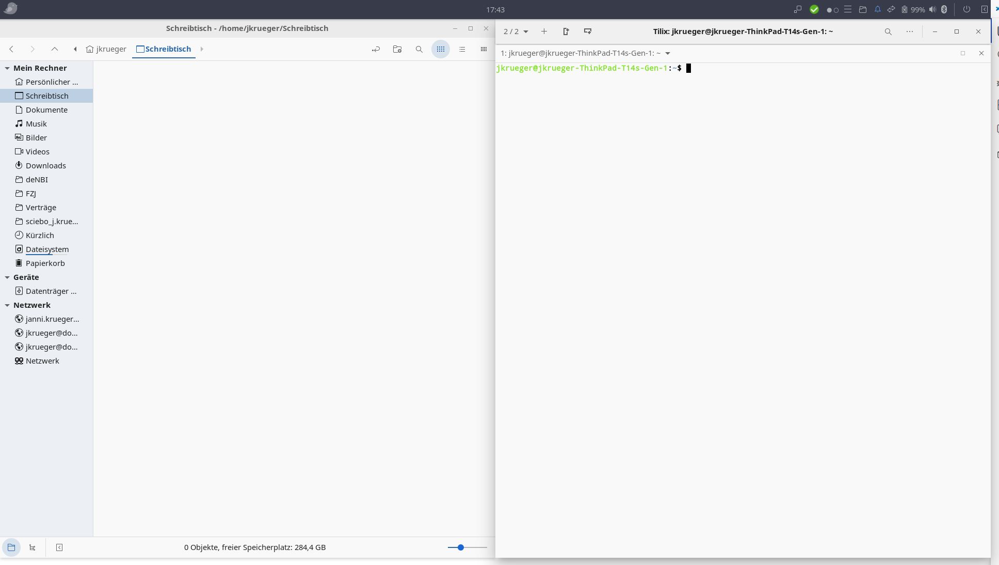

# Kleine Einführung in das Linux Dateisystem

In diesem Tutorial geht es darum sich etwas mit dem Linux Dateisystem und der Kommandozeile vertraut zu machen.  Solltest Du dich hiermit schon sicher fühlen kannst Du diesen Teil ohne Probleme überspringen.

Die Begriffe Konsole Terminal und Kommandozeile sind als Synonyme zu verstehen.

Für die Einführung brauchst Du den Datei-Manager und ein Terminal. Es ist es hilfreich wenn Du dir den DateiManager auf die linke Hälfte des Bildschirm und das Terminal auf die rechte Hälfte des Bildschirm legst.

_TIPP: In vielen modernen System kannst Du mit der \<WINDOWS\> oder \<Compose\> oder \<Apfel\> Taste (welche Taste es ist hängt von der Tastertur ab) + den Pfeiltasten die Fenster einfach auf dem Bildschirm anordnen._

Das Terminal ist ein sehr mächtiges Werkzeug für den der es beherrscht. Wir lernen nur einen sehr kleinen Teil der Funktionalität kennen. Das Terminal(oder auch Shell) kommt mit einer "History" Funktion daher, das heisst das Terminal "merkt" sich letzten Befehle die  man ausgeführt hat. Mit den Pfeiltasten (Hoch  bzw. Runter) kann durch die History navigieren. Wieviele Befehle sich gemerkt werden hängt von den Systemeinstellung des Terminals bzw. der Shell ab (normallerweise 1000).

Mit Strg + r kannst auch in der History suchen |

## Wichtige Kommandozeilen-Befehle:

| Befehl | Erklärung |
| ---  | --- |
| ls   | listet den Inhalt des aktuellen Verzeichnis |
| ls -al | listet den kompletten Inhalt des aktuellen Verzeichnis als Liste |
| cd _\<Verzeichnis\>_ | wechselt in das angegebene Verzeichnis |
| cd | wechselt in das Heimatverzeichnis des Benutzers |
| pwd | gibt das aktuelle Verzeichnis aus in dem ich mich befinde |
| tree | gibt einen Verzeichnisbaum ausgehend von dem aktuellen Verzeichnis aus |
| cat _\<DATEI\>_ | gibt eine **Text**-Datei auf der Konsole aus |
| less _\<DATEI\>_ | gibt eine **Text**-Datei **seitenweise** auf der Konsole aus |
| mkdir _\<DATEI\>_ | erzeugt ein neues Verzeichnis in dem aktuellen Verzeichnis |
| history | listet die History der Konsole auf |
| cp _\<DATEI\>_ _\<Ziel\>_| kopiert eine Datei in das Verzeichnis **Ziel** |
| mv _\<DATEI\>_ _\<Ziel\>_| verschiebt eine Datei in das Verzeichnis **Ziel** |
| rm _\<DATEI\>_ | löscht eine Datei |
| rm -r _\<Verzeichnis\>_ | löscht ein Verzeichnis (mit Inhalt!) |
| touch _\<DATEI\>_ | legt eine neue Datei an |
| python3 | ruft Python im interaktiven Modus auf |
| python3 _\<DATEI\>_ _[ARG1]_ _[ARG2]_ _[...]_ | ruft ein Python Programm auf. |

## Übung

1. Erzeugt ein Verzeichnis "maker" in eurem Heimatordner.
1. Wechselt in das Verzeichnis "maker".
1. Erstellt ein Verzeichnis "wordclock" in diesem Verzeichnis.
1. Wechselt in das Verzeichnis "wordclock".
   - Das erstellte Verzeichnis ist der Start
1. Gebt den aktuellen Verzeichnispfad aus. 
   - Welcher Kommandozeilenbefehl hilft dir dabei ?
   - Wie kommt man noch an die Informationen ?
1. Erzeugt ein Verzeichnis "Erste Schritte".
   - Welches Problem könnte es geben ?
   - Wie kannst Du das Problem lösen ?

